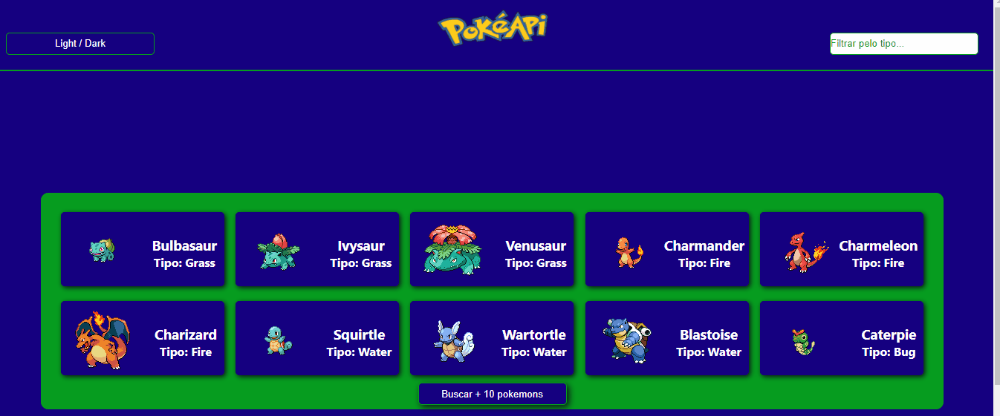

# Projeto PokéAPI

## Objetivo

- Construir uma aplicação Web que consome a PokéAPI para apresentar ao usuário uma lista de pokemons. Essa aplicação terá a funcionalidade de mudança de tema, filtro de pokemons pelo tipo e exibirá os movimentos e habilidades de um determinado pokemon selecionado pelo usuário. 

<br>

## Índice 📜

#### Screenshot

#### Requisitos do Projeto

#### O Projeto

#### Funcionalidades

#### Tecnologias Usadas

#### Como utilizar

<br>

## Screenshot 🎬

<div align='center'>

</div>

<br>

## Requisitos do Projeto 🧾

- A aplicação deverá ser Single Page Application (SPA);
- Utilizar React.js para o desenvolvimento da aplicação;
- Utilizar Context API para criação do Theme Toggler(Alternador entre os temas light e dark);
- Utilizar styled-components para estilização dos componentes;
- Utilizar react-router-dom para a navegação entre as páginas;

<br>

## O Projeto 📚

Este projeto foi criado como um SPA (Single Page Application) utilizando o React e a biblioteca React Router Dom para fazer o direcionamento das páginas. O tema de cores é distribuído por toda a aplicação através do Context API e, além do mais, toda a estilização foi feita utilizando a biblioteca Styled Component.

<br>

## Funcionalidades ⚙

- Exibição de 10 cards de pokémons
- Botão de carregamento de mais pokémons
- Página de detalhe do pokémon
- Mecanisno de filtrar por tipo
- Botão de troca de temas

<br>

## Tecnologia Usada 🛠

- React;
- Styled Components;
- React Router DOM;

<br>

## Como utilizar 🎮

1 - Clone para o projeto: 

```
git@github.com:ederhscc/project-poke-api.git
```
No seu terminal, instale as dependências necessárias executando npm install ou yarn install.

2 - Ainda no seu terminal, execute o comando npm start ou yarn start para iniciar o servidor de desenvolvimento;
3 - O seu navegador deverá abrir mostrando que o servidor está rodando no endereço http://localhost:3000/;
4 - Clique no botão buscar mais dez para carregar mais dez pokemons na tela;
5 - Clique no botão de alternar tema no canto superior esquerdo para alternar entre os temas dark e light;
6 - Digite um tipo de pokemon no campo superior direito para filtrar os pokemons listados;
7 - Clique na foto do pokemon para mostrar a lista de movimentos e as habilidades do pokemon.

<br>

## Autor 🧑

### Eder Henrique Santos

<br>

## Links 🔗

Deploy:

<div align="left">

  <a href = "mailto:ederhscc@gmail.com" target="_blank">
  
  </a>
  </br>
  <a href="https://www.linkedin.com/in/eder-henrique-santos" target="_blank">
  
  </a>
  </br>

</div>